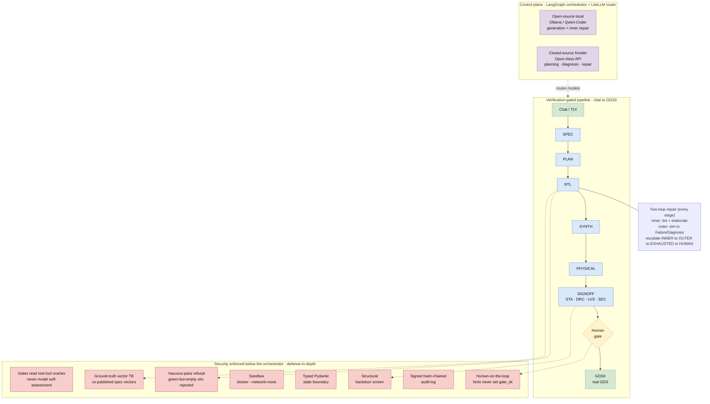
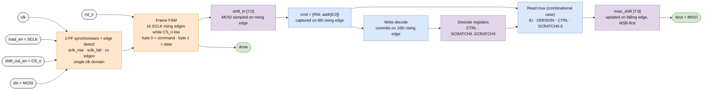

# A Verification-Gated, Adversarially-Robust
## Agentic Flow for Open-Source IC Design
### IEEE SSCS PICO Open-Source Chipathon 2026 · Track D (AI / LLM-assisted Circuits)

[](https://github.com/Lefteris-B/Chipathon_2026_Secure_agentic_chip_design/actions/workflows/release.yml)

<p align="center">
  
  
  
  
  
</p>
<p align="center">
  
  
  
  
  
  
</p>
<p align="center">
  
  
  
  
</p>

> **Trust from architecture, not from the model's self-report.** An agentic pipeline that
> takes a natural-language chip spec and drives it through a complete **RTL → GDSII** flow —
> where **no stage advances on the model's own assessment.** Every gate reads `gate_ok` from
> a real tool oracle, behavioural gates check the design against **ground-truth** spec
> vectors, a green-but-vacuous result is **refused**, tool execution runs in a **network-less
> sandbox**, and every decision lands in a **tamper-evident, signed** provenance chain. A
> hijacked *or simply mistaken* agent cannot certify its own output into silicon.

**Demonstration vehicle:** an **SPI-slave register file**, taped through to a
real GDSII stream-out on **gf180mcuD**.

---

## Table of contents

- [A Verification-Gated, Adversarially-Robust](#a-verification-gated-adversarially-robust)
  - [Agentic Flow for Open-Source IC Design](#agentic-flow-for-open-source-ic-design)
    - [IEEE SSCS PICO Open-Source Chipathon 2026 · Track D (AI / LLM-assisted Circuits)](#ieee-sscs-pico-open-source-chipathon-2026--track-d-ai--llm-assisted-circuits)
  - [Table of contents](#table-of-contents)
  - [Why this project](#why-this-project)
  - [How it works](#how-it-works)
  - [The security model — the gate cannot lie](#the-security-model--the-gate-cannot-lie)
  - [Technical stack](#technical-stack)
  - [Quick start](#quick-start)
  - [Usage](#usage)
  - [Repository layout](#repository-layout)
  - [Demonstration vehicle — SPI-slave register file](#demonstration-vehicle--spi-slave-register-file)
  - [Results (measured)](#results-measured)
  - [Roadmap](#roadmap)
  - [Team](#team)
  - [License \& acknowledgements](#license--acknowledgements)

---

## Why this project

Agentic chip-design pipelines ingest specifications and reference material from untrusted
sources and invoke EDA tools with broad system access. Two failure modes follow, and they
collapse into the same question — **can the flow be advanced by an assertion the agent
itself controls?**

- **Manipulated agent** — an adversarial spec steers the agent into a subtly-degraded or
  backdoored implementation while still looking legitimate to a human reviewer.
- **Mistaken agent** — no adversary at all: the model produces wrong RTL and then *reports
  success* because the check it ran was too weak, too short, or self-graded.

The most dangerous artifact is not a wrong answer in a chat window — it is a fabricated chip
that *passed every check* because the check was the thing that got compromised. This project
makes that bypass **structurally unavailable**.

## How it works

A natural-language spec — typed into the chat REPL or read from a `.md` file — is driven
through a **verification-gated state machine** over the LibreLane spine:



Each stage is a ReAct specialist wrapped in a **two-loop repair** (inner: lint + elaborate;
outer: simulation → typed `FailureDiagnosis`) with a bounded escalation ladder. A stage
promotes its output to `head` **only** when the gate reads `gate_ok` from a real verification
artifact; the control-graph edges are pure functions of the blackboard, so traversal is
deterministic and replayable. At SIGNOFF the run pauses for human approval, and on approval
the GDSII stage streams out a real GDS via Magic inside the container.

> 📐 Architecture diagrams (open in [draw.io](https://app.diagrams.net)):
> [`noesi_overview.drawio`](./noesi_overview.drawio)

## The security model — the gate cannot lie

Security is enforced at **independent layers below the orchestrator** (defense-in-depth), so
a compromise at the orchestration layer does not cascade into gate authority, tool access,
or network egress.

| Layer | Property |
|---|---|
| **Gates read real oracles** | `gate_ok` comes from Verible / Verilator / cocotb / Yosys / OpenSTA / Magic / Netgen — never from model output. SIGNOFF is a conjunction over STA · DRC · LVS · security. |
| **Ground-truth behavioural gate** | For vector-specified blocks, the DUT is checked against **published spec vectors**, not a model-generated oracle. |
| **Vacuous-pass refusal** | A green sim whose completion port never asserts is **refused, not promoted** (`SIM_VACUOUS_PASS`) — even non-interactive runs halt for review. |
| **Sandbox isolation** | `docker run --network=none`, CPU / memory / time caps, only the design dir mounted, PDK read-only. |
| **Typed state boundary** | Pydantic strict schemas; no freeform text carries state between stages. |
| **Structural backdoor screen** | Always-on nets / suspicious identifiers close the SIGNOFF security gate. |
| **Tamper-evident provenance** | HMAC-SHA256 hash-chained audit log; every gate decision is signed and replayable. |
| **Human-on-the-loop** | Mandatory approval before GDSII; operator hints re-seed bounded retries but **can never set `gate_ok`.** |

## Technical stack

NoeSI **works with both closed- and open-source LLMs, and mixes them by design** — one
uniform LiteLLM interface routes high-volume generation/repair to a **local open-source**
model and planning/diagnosis to a **closed-source frontier** model, split per task and
escalation level.

| Layer | Technology |
|---|---|
| Orchestration | **LangGraph** `StateGraph` + SQLite checkpointing / human-gate interrupt |
| Model gateway | **LiteLLM** — uniform API over open + closed models; per-task routing + fallback |
| Local serving | **Ollama** (Qwen-Coder class) — candidate generation, inner-loop repair |
| Frontier | closed-source API (Opus-class) — planning, semantic diagnosis, `EXHAUSTED` repair |
| Flow spine | **LibreLane** (Python Step/Flow API) |
| EDA toolchain | Yosys · OpenROAD · Magic · KLayout · Netgen · OpenSTA · Verilator · iverilog · cocotb · Verible (pinned **IIC-OSIC-TOOLS** image) |
| Sandbox | **Docker** (`--network=none`, resource caps, single design-dir mount) |
| PDK | **gf180mcuD** / sky130A |
| Data plane | content-addressed artifact store (SQLite index + blob dir), **Pydantic v2** |
| Observability | HMAC-signed hash-chained audit log + JSONL / Langfuse trace |
| Operator UX | `chip-agent` CLI (`chat` / `run` / `resume`) + **Textual** TUI |
| Quality | Python 3.12 · ruff · mypy `--strict` · pytest |

## Quick start

> Requires Python 3.12, `uv` (or `pip`), and Docker with the pinned IIC-OSIC-TOOLS image for
> real tool execution. Tool-backed steps auto-skip when Docker is unavailable.

```bash
make setup            # uv sync + pull the pinned LibreLane / IIC-OSIC-TOOLS container
make lint test        # ruff + mypy --strict + pytest

# stub run (no Docker needed) — spec to human gate, end to end
chip-agent run --spec specs/counter.md
```

## Usage

```bash
# 1) Chat your way to a spec, then run
chip-agent chat                       # NL dialog → typed Spec

# 2) Drive a spec to a real GDS on gf180mcuD
chip-agent run   --sandbox docker --config configs/frontier-only.yaml --spec specs/spi_slave_regs.md
chip-agent resume --design-id <design-id>          # approve the human gate → GDSII

# 3) One-window operator TUI (chat · pipeline · audit · exports)
chip-agent tui
```

Model routing is selected by config: `configs/frontier-only.yaml` (closed-source),
`configs/local-only.yaml` (open-source via Ollama), `configs/demo-ollama.yaml` (hybrid
local + frontier fallback). See [`model_routing.md`](./model_routing.md).

## Repository layout

```
chip_agent/
  design_state.py     # blackboard schema (typed Pydantic artifacts)
  store/              # content-addressed artifact store (SQLite + blob dir)
  graph/              # LangGraph control graph, gates, escalation, human repair
  agents/             # stage specialists + prompts (spec, plan, rtl, tb, signoff, …)
  tools/              # typed EDA tool services (librelane, yosys, opensta, magic, netgen, …)
  routing/            # LiteLLM router + routing policy (open + closed models)
  obs/                # signed audit log, tracing, replay
  tui/                # Textual operator UI
  evals/              # VerilogEval / RTLLM harness
configs/              # PDK / flow / model-routing configs
specs/                # example specs (counter, spi_slave_regs, alu, fsm, …)
docs/                 # architecture, features, proposal, diagrams
tests/                # pytest suite
```

## Demonstration vehicle — SPI-slave register file

An **SPI slave** (Mode 0, CPOL=0/CPHA=0) exposing an 8-bit-addressed register file.
Chosen because the `D10_D` padframe slot provides only **9 user pins**, and an SPI bus maps
onto them one-for-one — so the whole chip is externally exercisable with any USB-SPI dongle:
read `0x00`, get `0x5A`; write a scratch byte, read it back.

**The padframe pin names are the organiser template's and are kept verbatim, but this design
drives them as an SPI bus:**

| `D10_D` pad | SPI role |
|---|---|
| `clk` | system clock — the **only** clock domain |
| `rst_n` | asynchronous reset, active low |
| `load_en` | **SCLK** — *sampled through a 2-FF synchroniser, never used as a clock* |
| `shift_out_en` | **CS_n**, active low |
| `din` | **MOSI** |
| `dout` | **MISO** |
| `done` | transaction complete (high after a well-formed 16-bit frame) |

A frame is 16 SCLK rising edges while CS_n is low: byte 0 is `{RW, addr[6:0]}` (RW=1 writes),
byte 1 is data. MOSI is sampled on the rising edge, MISO updated on the falling edge.
SCLK must be driven at no more than `clk/8`.

| addr | name | access | reset |
|---|---|---|---|
| `0x00` | `ID` | RO | `0x5A` |
| `0x01` | `VERSION` | RO | `0x01` |
| `0x02` | `CTRL` | RW | `0x00` |
| `0x10`–`0x13` | `SCRATCH` | RW | `0x00` |

| Parameter | Value |
|---|---|
| User I/O pins | **9** (`VDD`, `VSS` + the 7 signals above) |
| Clock target | 13 ns (core spec targets 10 ns) |
| PDK / cells | gf180mcuD / `gf180mcu_fd_sc_mcu7t5v0` |
| Core std-cell instances | **249** (0 inferred latches) |
| `D10_D` macro instances | 7,347 including fill / decap / tap |
| Die area | 550 × 550 µm = 0.3025 mm² (fixed by the padframe slot) |



## Results (measured)

From the committed `spi_slave_regs_r3` run, driven end-to-end from a natural-language spec
to a **real, valid multi-megabyte GDSII**, then rehardened as the `D10_D` padframe macro:

| Metric | Value |
|---|---|
| Magic DRC errors | **0** |
| Netgen LVS | **0 errors — "Circuits match uniquely"**, incl. `VDD`/`VSS` |
| Routing DRC (detailed route) | 39 → 1 → **0** over three iterations |
| Setup violations / WNS | **0 / 0 ns** |
| Hold violations / WNS | **0 / 0 ns** |
| Max slew / max cap violations | **0 / 0** |
| Antenna violations (nets / pins) | **0 / 0** |
| Inferred latches | **0** |
| XOR vs reference layout | **clear** |
| Total power | ≈ 24.6 mW |

Functional sign-off before physical implementation: a ground-truth SPI vector testbench
replayed **17 transactions** with **13 checked register reads**, asserting `done` on every
frame — so a green simulation cannot be vacuous.

**Honest status:** DRC-clean, LVS-clean, and timing-closed at **all nine corners** (no
slow-corner gap). Two caveats worth stating plainly:

* **KLayout DRC did not run** — `KLAYOUT_DRC_RUNSET` is unset for gf180mcuD, so the step is
  skipped by LibreLane. Layout DRC coverage is **Magic-only**.
* A single `max_fanout` violation is reported at every corner. It is the CTS clock root
  (`clkbuf_0_clk` driving 16 sinks) measured against the *data* fanout constraint of 4 used
  during optimisation; the clock tree itself is healthy (worst hold skew ≈ −0.26 ns,
  consistent across corners). Non-gating.

## Roadmap

- [ ] **Gate 0** static pre-flight config scanner (standalone package)
- [ ] Red-team corpus + hardened-vs-unhardened **ASR / UAR** study *(the empirical robustness result)*
- [ ] Packaged bring-up + on-chip measurement
- [ ] *(stretch)* SymbiYosys BMC formal equivalence vs a reference model

## Team

**SystemsGenesys** — IEEE SSCS PICO Open-Source Chipathon 2026, Track D.

| Name | Affiliation |
|---|---|
| _[Eleftherios Batzolis]_ | Democritus Univercity of Thrace , Institute of Language and Speech Processing (ILSP)
| _[Dr. Konstantinos Rantos]_ | Democritus Univercity of Thrace
| _[Dr. Drosatos Georgios]_ | Institute of Language and Speech Processing (ILSP)

_Template placeholders — replace with the team's real names and contacts._

## License & acknowledgements

Released under the **MIT License**. Built entirely on open-source infrastructure:
LibreLane, OpenROAD, Yosys, Magic, KLayout, Netgen, OpenSTA, Verilator, cocotb, Verible, the
**gf180mcu** PDK (bundled in the pinned IIC-OSIC-TOOLS image), LangGraph, LiteLLM, and
Ollama. Developed for the IEEE SSCS PICO Open-Source Chipathon 2026, sponsored by the
OpenROAD Initiative.